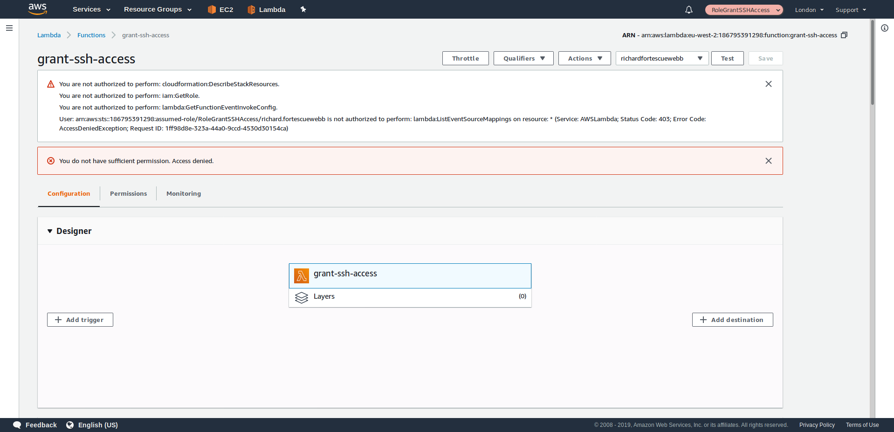
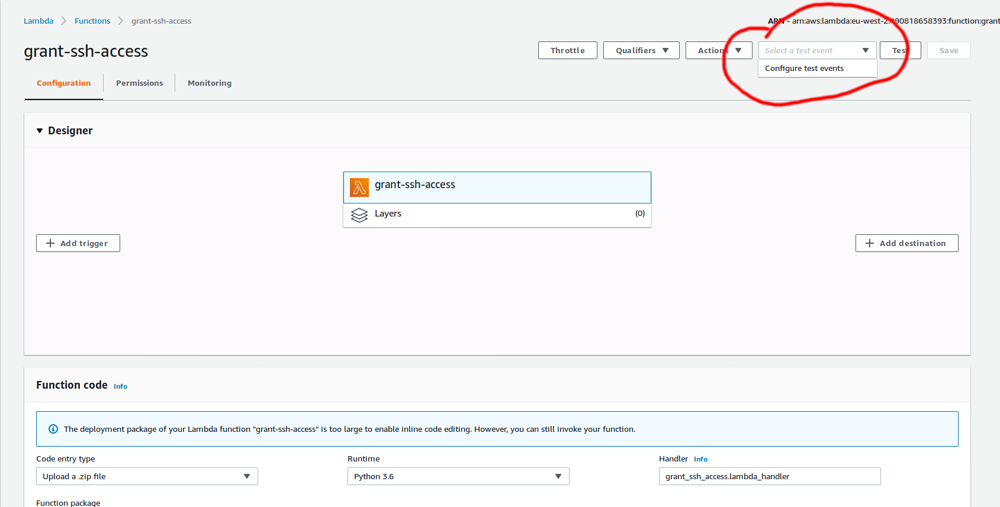
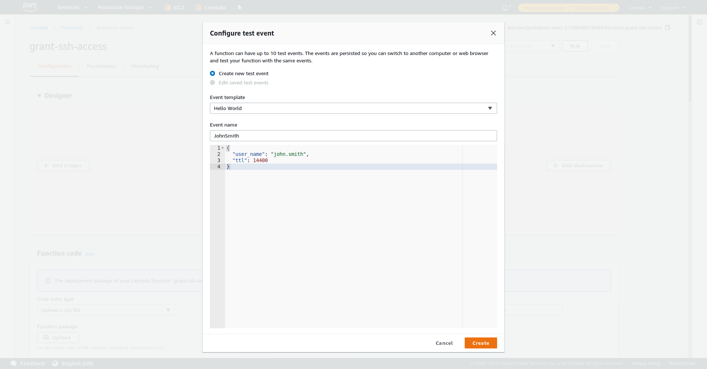
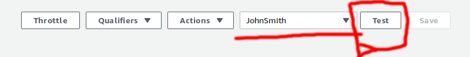
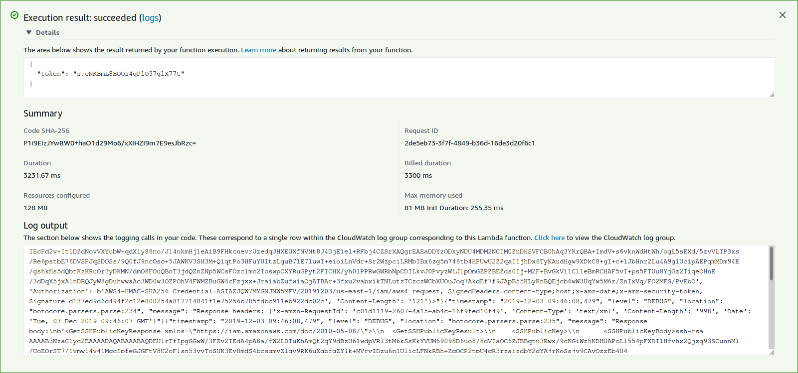

# grant-ssh-access

This is a lambda that takes a username and public key, and:
- Signs the public key using Vault.
- Wraps the signed public key using Vault's Wrapping service.
- Returns the wrapping token back to the caller.

## Instructions for granting SSH Access to an Engineer

(Written from the perspective of a user with the GrantSSHAccess role. e.g. a Platform Owner)

If you have AWS CLI and the engineer has sent you a command to run, follow instructions [here](#instructions-for-running-aws-command)

The engineer will have sent you a JSON snippet, something like the following:
```
{
    "user_name": "john.smith",
    "ttl": 14400
}
```

They will also let you know which environment they'd like to access.

The process is as follows:
1. Assume the RoleGrantSSHAccess role for the environment the engineer would like access to. 
    - Use the set of links below to assume this role.
   
| Environment | Account Number | RoleGrantSSHAccess links |
|-------------|----------------|---------------------|
| Integration | 150648916438   | [RoleGrantSSHAccess](https://signin.aws.amazon.com/switchrole?account=150648916438&roleName=RoleGrantSSHAccess&displayName=RoleGrantSSHAccess) |
| Development | 618259438944   | [RoleGrantSSHAccess](https://signin.aws.amazon.com/switchrole?account=618259438944&roleName=RoleGrantSSHAccess&displayName=RoleGrantSSHAccess) |
| QA          | 248771275994   | [RoleGrantSSHAccess](https://signin.aws.amazon.com/switchrole?account=248771275994&roleName=RoleGrantSSHAccess&displayName=RoleGrantSSHAccess) |
| Staging     | 186795391298   | [RoleGrantSSHAccess](https://signin.aws.amazon.com/switchrole?account=186795391298&roleName=RoleGrantSSHAccess&displayName=RoleGrantSSHAccess) |
| External Test | 970278273631 | [RoleGrantSSHAccess](https://signin.aws.amazon.com/switchrole?account=970278273631&roleName=RoleGrantSSHAccess&displayName=RoleGrantSSHAccess) |
| Production  | 490818658393   | [RoleGrantSSHAccess](https://signin.aws.amazon.com/switchrole?account=490818658393&roleName=RoleGrantSSHAccess&displayName=RoleGrantSSHAccess) |


2. Navigate to the grant-ssh-access lambda in the AWS console. [Link](https://eu-west-2.console.aws.amazon.com/lambda/home?region=eu-west-2#/functions/grant-ssh-access?tab=configuration)
  - You may see some error messages about permissions. This is not a problem.
3. You will see a screen as follows: 
4. Click the 'Select a test event' dropdown menu at the top right of the page and click Configure test events: 
5. You will see a popup appear. Delete the JSON shown, and replace it with the JSON the engineer sent you: 
6. Type the user's name in the Event name field and click the create button at the bottom: 
7. Ensure the event that you just created is selected, and click the 'Test' button: 
8. Once the lambda has successfully executed, you will see a green box with something like this:
```
{ 
  "token": "12joi1j2oijb1ij2voij1vij1" 
}
```

9. Send the token to the engineer who requested access. The token is not sensitive, so can be sent via slack / email / pigeon.

## Instructions for running AWS command
If the engineer sent you an AWS command to run.

1. Ensure you have the AWS CLI setup
2. Run the command using the appropriate profile.
3. Send the generated token to the user. The token is not sensitive, so can be sent via slack / email / pigeon.


## Configuration

#### Required Vault permissions
```
"path "ssh-platsec-poc/sign/signer-poc" {
  capabilities = ["create", "update"]
}

path "sys/wrapping/wrap" {
  capabilities = ["create"]
}
```

#### Environment variables
- `ENVIRONMENT` - `development`/`integration`/`qa`/`externaltest`/`production`
- `VAULT_ROLE_ID` - AppRole ID
-  `VAULT_SECRET_ID` - AppRole secret

### License

This code is open source software licensed under the [Apache 2.0 License]("http://www.apache.org/licenses/LICENSE-2.0.html").
